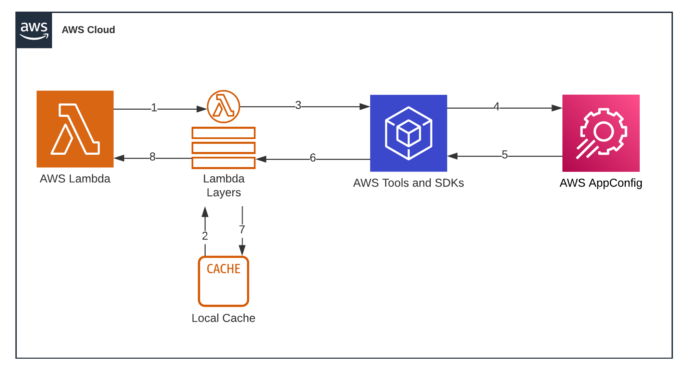

# Lambda-AppConfig

An AWS CDK application that uses the AppConfig extension (Lambda Layer) for Lambda to get feature flags or other freeform configuration data.

In the example, we have a configuration about a third-party API call.

## Prerequisites

* Nodejs (see [package engines](package.json) for version)
* Docker

## Component Structure

The application contains:
* An AppConfig application, environment, configuration profile (hosted), and deployment strategy.
* Lambda extention (pulled in as a layer) for grabbing AppConfig data. 
* Lambda pointed from `src/lambdas/demo/handler.ts`, containing code that pulls data from AppConfig and caches locally.

## Deployment

Run `npx cdk deploy`. This will deploy the stack(s) to your AWS account.
